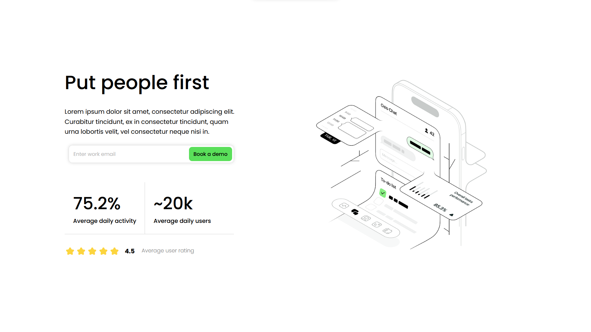
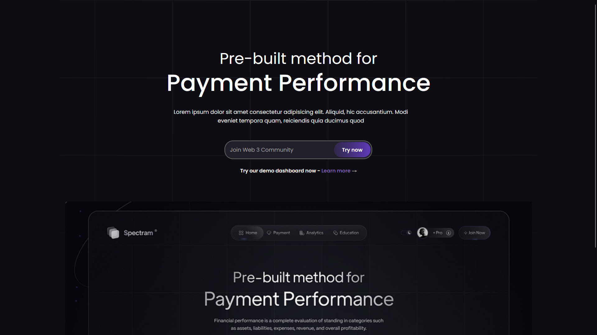
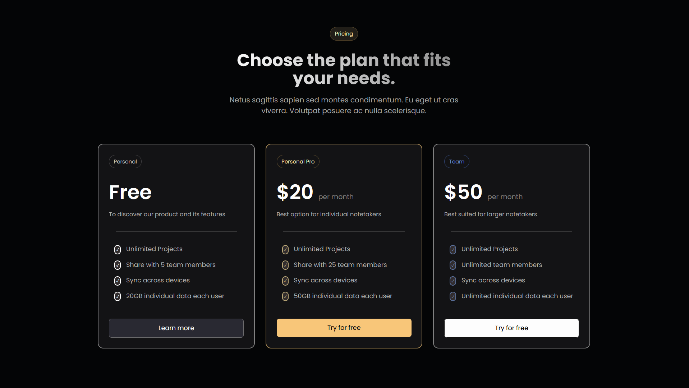
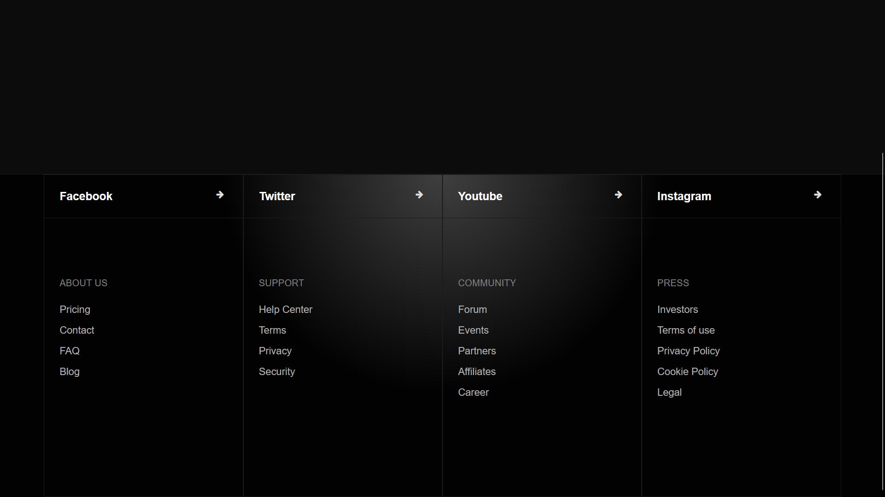

# 🎨 ASMR JavaScript: HTML & CSS Beginner Projects

Welcome to the **ASMR JavaScript: HTML & CSS Beginner Projects** repository! 🎉  
This collection features **20 creative CSS projects** designed to help beginners practice and improve their CSS and design skills. Each project focuses on essential web design concepts, ranging from simple cards to fully fledged sections.

---

## 🌟 Projects Included

1. **Hero Section Design**  
   Create a simple hero section with images and a responsive layout.

2. **Responsive Navigation Bar**  
   Design a navigation bar that transforms into a hamburger menu on smaller screens using only HTML and CSS.

3. **Basic Landing Page**  
   Build a landing page with a visually appealing hero section and stylish call-to-action buttons.

4. **CSS Grid Photo Gallery**  
   Create a photo gallery using CSS Grid with hover effects like zoom-in or grayscale.

5. **Animated Buttons**  
   Design buttons with hover animations like color changes, scaling, and ripple effects.

6. **Card Design**  
   Craft reusable cards for content like products, blog posts, or services with hover effects and shadows.

7. **CSS Typography Styles**  
   Experiment with font styles, sizes, line spacing, and text shadows to showcase typography.

8. **Pricing Table**  
   Design a pricing table with columns for different plans, highlighted with borders, colors, and hover effects.

9. **CSS-only Accordion**  
   Build an accordion menu using only HTML and CSS that expands and collapses sections.

10. **Animated Loading Spinner**  
    Create a custom loading spinner animation with CSS keyframes.

11. **Social Media Icons with Hover Effects**  
    Style social media icons with hover effects like scaling, rotation, and color changes.

12. **Progress Bar Animation**  
    Animate a progress bar from 0% to 100% with CSS transitions.

13. **Tooltip Styling**  
    Add tooltips with smooth fade effects and custom styling.

14. **CSS Shapes and Patterns**  
    Design circles, triangles, hexagons, and background patterns.

15. **Simple Modal Popup**  
    Build a modal popup with shadows, rounded corners, and smooth transitions.

16. **Sticky Footer**  
    Create a layout where the footer stays at the bottom of the page.

17. **Image Hover Effects**  
    Add hover effects like zoom-in, grayscale, and overlay text to images.

18. **Animated Gradient Background**  
    Design a page with a smoothly transitioning gradient background.

19. **CSS Timeline**  
    Showcase events or milestones with a CSS-based timeline layout.

20. **3D Card Effect**  
    Design a 3D card with interactive hover effects.

---

## 🖼️ Design Previews

### Hero Section Design


### Landing Section Design


### Pricing Section Design


### Animated Buttons


*Check out the full collection by browsing the repository!*

---

## 🛠️ Technologies Used

- **HTML**
- **CSS**

---

## 🚀 How to Use

1. Clone this repository:  
   ```bash
   git clone https://github.com/MaverickPoly/asmr-javascript-css_beginner.git
   ```
2. Open any project folder.
3. Open the `index.html` file in your browser to view the design.

---

## 🤝 Contributions

Feel free to submit issues, fork the repository, or make a pull request to add your creative CSS designs!

---


### 🖤 Happy Coding!